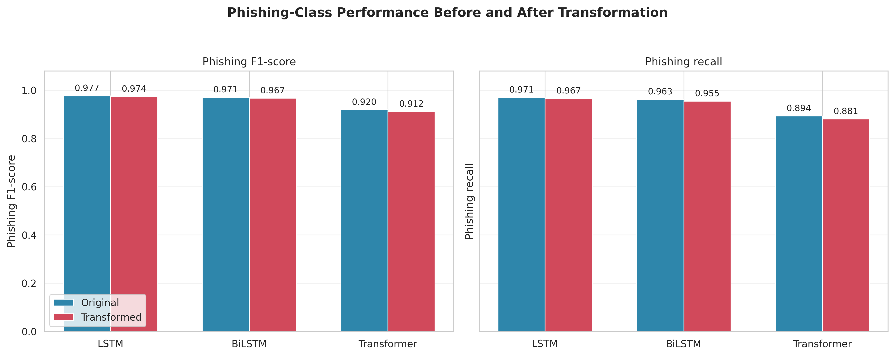
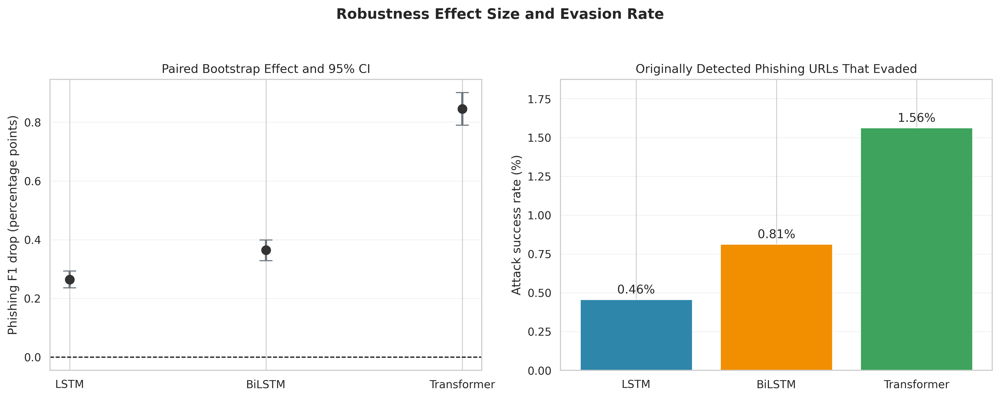

# Character-Level Phishing URL Detection Under Selective Percent-Encoding

This repository evaluates the robustness of three character-level neural
classifiers—LSTM, bidirectional LSTM (BiLSTM), and Transformer—for phishing URL
detection. The models are tested on both original URLs and URLs processed by a
deterministic selective percent-encoding transformation.

The central result is that aggregate test scores can hide concentrated
weaknesses: only 12.29% of the test URLs changed under the implemented
transformation, and performance on that changed subset was noticeably lower
than performance on the full transformed test set.

## Dataset

The experiments use the Kaggle
[Phishing and Legitimate URLs](https://www.kaggle.com/datasets/harisudhan411/phishing-and-legitimate-urls)
dataset. The loaded CSV contains 822,010 labeled URLs and two columns:

| Column | Description |
|---|---|
| `url` | URL string used as model input |
| `status` | Binary label: `0` = phishing, `1` = legitimate |

The dataset contains 394,982 phishing URLs (48.05%) and 427,028 legitimate
URLs (51.95%). The executed notebook uses a seed-42 stratified split:

| Partition | URLs | Share |
|---|---:|---:|
| Training | 493,206 | 60% |
| Validation | 164,402 | 20% |
| Test | 164,402 | 20% |

## Methodology

- Character-level input representation
- Maximum URL length: 200 characters
- Character vocabulary size: 329
- Embedding dimension: 128
- Models: LSTM, BiLSTM, and Transformer
- Decision threshold: 0.5
- Paired evaluation on original and transformed versions of the same test URLs
- Phishing is explicitly treated as the positive class when calculating
  precision, recall, F1, and PR-AUC
- Robustness analysis includes paired bootstrap confidence intervals, McNemar's
  test, attack success rate (ASR), changed-only evaluation, and truncation
  diagnostics

The implemented transformation should be described as **selective
percent-encoding**, not complete hexadecimal domain obfuscation. It changes
20,204 of 164,402 test URLs and leaves common ASCII hostname characters
unchanged.

## Main Results

| Model | Original phishing F1 | Transformed phishing F1 | F1 decrease | ASR | Changed-only F1 |
|---|---:|---:|---:|---:|---:|
| LSTM | 0.9770 | 0.9743 | 0.0026 | 0.46% | 0.9476 |
| BiLSTM | 0.9710 | 0.9673 | 0.0036 | 0.81% | 0.9277 |
| Transformer | 0.9200 | 0.9116 | 0.0084 | 1.56% | 0.8196 |

LSTM achieved the highest phishing F1 and the smallest observed robustness
decrease. Transformer showed the largest F1 decrease and evasion rate in this
specific experiment. These results apply only to the executed dataset, model
configurations, split, and transformation.

## Visualizations

### Phishing performance



### Robustness effect and attack success rate



Additional figures:

- `FIG3_Transformation_Diagnostics.png`: transformation coverage and URL-length diagnostics
- `FIG4_Phishing_PR_Curves.png`: phishing-class precision–recall curves

## Repository Contents

| File | Purpose |
|---|---|
| `notebook24fa603559 (2).ipynb` | End-to-end training, evaluation, and visualization notebook |
| `lstm_best.weights.h5` | Best saved LSTM weights |
| `bilstm_best.weights.h5` | Best saved BiLSTM weights |
| `transformer_best.weights.h5` | Best saved Transformer weights |
| `FIG1_Phishing_Performance.png` | Original versus transformed phishing F1 and recall |
| `FIG2_Robustness_ASR_CI.png` | F1 decrease with 95% CI and ASR |
| `FIG3_Transformation_Diagnostics.png` | Transformation coverage and truncation analysis |
| `FIG4_Phishing_PR_Curves.png` | Precision–recall curves |
| `TABLE4_Robustness_Diagnostics.csv` | Detailed robustness statistics |
| `Character_Level_Phishing_URL_Robustness_IEEE.tex` | IEEE-style manuscript source |

If the filenames in your repository differ, update this table or rename the
files so that the manuscript and image links remain valid. For cleaner GitHub
links, consider renaming the notebook to `phishing_url_robustness.ipynb`.

## Running the Notebook

1. Open the notebook in Kaggle or a compatible Jupyter environment.
2. Attach the Kaggle dataset listed above.
3. Enable a GPU accelerator if available.
4. Run the notebook from top to bottom to reproduce preprocessing, training,
   evaluation, and exported figures.
5. Generated images and CSV tables are written to the notebook's working
   directory. On Kaggle, this is normally `/kaggle/working`.

Typical Python dependencies include:

```text
numpy
pandas
tensorflow
scikit-learn
scipy
statsmodels
matplotlib
seaborn
```

## Compiling the Paper

Place the manuscript and the four PNG figures in the same directory, then
compile the LaTeX source with an IEEE-compatible LaTeX installation:

```bash
latexmk -pdf Character_Level_Phishing_URL_Robustness_IEEE.tex
```

Before submission, replace the placeholder author, affiliation, and email
fields in the manuscript.

## Limitations

- The split is row-wise rather than grouped by registered domain or collection
  time, so related URLs may occur across partitions.
- Results are reported for one dataset and one training seed.
- The transformation changes only 12.29% of test strings and is not a general
  model of all URL-obfuscation attacks.
- Percent-encoding can increase URL length; 251 additional URLs exceed the
  200-character input limit after transformation.
- The Transformer run experienced numerical instability after the best finite
  checkpoint had already been saved.

## Responsible Use

This project is intended for defensive cybersecurity research and reproducible
evaluation of phishing detectors. It should not be used to deploy malicious
URLs or evade operational security systems.
